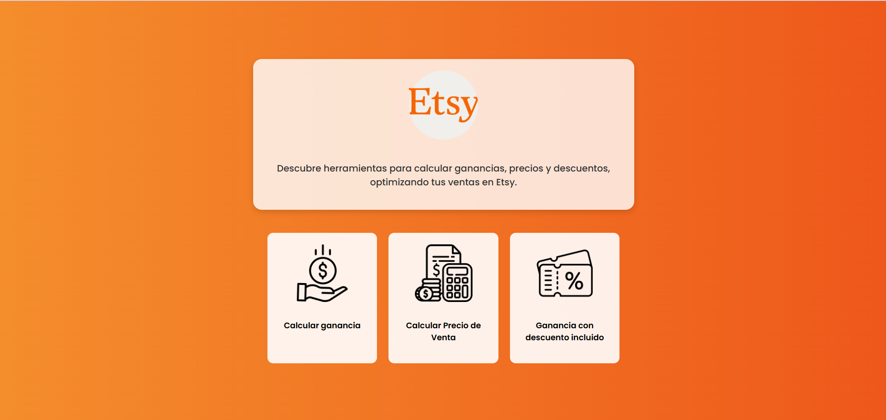

# Matias Morquecho | Full-Stack Developer

Full-stack developer who builds complete products end to end: REST APIs, modern web interfaces, payments, integrations and production deployments. My main stack is Django REST Framework and Vue 3, and I also work with Spring Boot and React.

🌐 **Live portfolio:** [portfolio-xi-roan-90.vercel.app](https://portfolio-xi-roan-90.vercel.app/)
💼 **LinkedIn:** [matias-morquecho](https://www.linkedin.com/in/matias-morquecho-52679633b/)
✉️ **Email:** [mork.morquecho@gmail.com](mailto:mork.morquecho@gmail.com)

---

## Featured Projects

### 🏝️ Island Finance

A personal finance app built around an archipelago metaphor: financial modules are archipelagos and your accounts are islands.

- Track cash, stocks and crypto across multiple accounts, with currency separation and MXN aggregation
- Live market data from CoinGecko, Twelve Data and Banxico, with smart caching
- Asset search with autocomplete
- Interest projections for cash accounts
- JWT authentication with automatic token refresh
- Custom tropical UI with animated, modal-based forms

**Stack:** Django REST Framework, Vue 3, Pinia, Vue Router, PostgreSQL, Docker, Railway, Vercel

🔗 [Live demo](https://islandfinance.cc) · 💻 [Backend](https://github.com/morkmorquecho/TU-REPO-API) · [Frontend](https://github.com/morkmorquecho/TU-REPO-WEB)

---

### 🎨 Colección Lorenza

A large e-commerce platform, art portfolio and blog in one, running in production.

- Full store with cart, checkout and wishlist
- Stripe payments (live mode)
- Bilingual content (ES/EN) with django-modeltranslation
- Media management with Cloudflare R2, including HEIC image uploads
- Transactional email with Resend
- Client-side caching with Pinia (TTL-based)
- Multi-currency price display

**Stack:** Django REST Framework, Vue 3, Pinia, PostgreSQL, Redis, Stripe, Cloudflare R2, Resend, Docker, Railway, Vercel

🔗 [Live site](https://colecccionlorenza.com) · 🔒 Code: private (commercial product)

---

### 🩺 GlucoBalance

A diabetes management app with an AI-powered chatbot.

- Log different types of health measurements and follow their history
- Food catalog with glycemic level for each item
- AI chatbot (OpenAI) to answer questions and guide daily management
- Clean dashboard to review progress over time

**Stack:** Spring Boot, React, OpenAI API

🎥 [Watch the demo](https://www.youtube.com/watch?v=D8alwyK5eeE) · 💻 [Backend](https://github.com/morkmorquecho/TU-REPO-API-GLUCO) · [Frontend](https://github.com/morkmorquecho/TU-REPO-WEB-GLUCO)

---

## Tech Stack

| Area | Technologies |
|------|--------------|
| **Backend** | Python, Django, Django REST Framework, SimpleJWT, drf-spectacular, Java, Spring Boot |
| **Frontend** | Vue 3, Vue Router, Pinia, Axios, React, TypeScript, JavaScript, CSS |
| **Data** | PostgreSQL, Redis |
| **Infrastructure** | Docker, Railway, Vercel, Cloudflare R2 |
| **Integrations** | Stripe, Resend, OpenAI, CoinGecko, Twelve Data |

---

## About This Portfolio

Built with [v0](https://v0.dev) using TypeScript, JavaScript and CSS, and deployed on Vercel.

## Contact

Open to new opportunities and collaborations.

- LinkedIn: [matias-morquecho](https://www.linkedin.com/in/matias-morquecho-52679633b/)
- Email: [mork.morquecho@gmail.com](mailto:mork.morquecho@gmail.com)

## License

© Matias Morquecho. All rights reserved. The code in this repository is shown for portfolio purposes and may not be copied or redistributed without permission.
